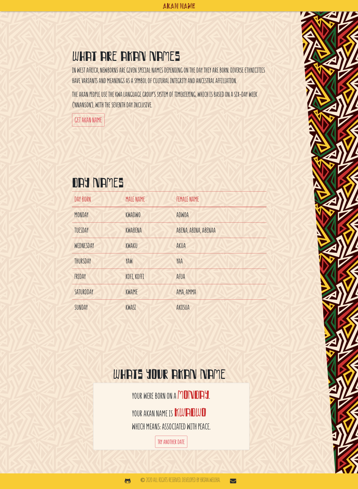

# Akan Names

## **Author**: Brian Weloba

## Description

In West Africa, newborns are given special names depending on the day they are born. Diverse ethnicities have variants and meanings as a symbol of cultural integrity and ancestral affiliation.

This site takes in the user's birthday and finds the day of week they were bor on. Based on that it calculates your Akan name.

The site was built using [GitHub Pages](htps://pages.github.com/).

## Page Preview

## Setup

 1. Clone this repository.
 2. Open the project directory.
 3. Run index.html on your browser.

- Alternatively, view on [GitHub Pages](https://brian-weloba.github.io/Portfolio-landing-page/).

## Technologies Used

- HTML
- CSS
- Javascript
- Git

## Legal

 Copyright &copy; 2020 Brian N Weloba
